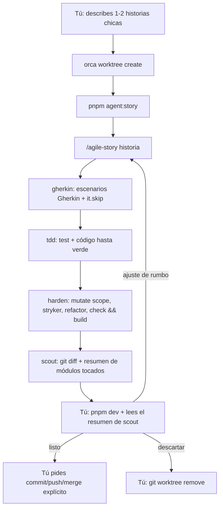

# Ciclo ágil TDD (agile-story) — cheatsheet

Carril por defecto para historias de usuario chicas (feature acotada, fix, ajuste de UI/componente), sin importar cuántos archivos toque. OpenSpec sigue disponible, pero solo si lo pides explícitamente. Contrato completo del pipeline: `.omp/AGENTS.md` y `docs/agent-pipeline.md`.

Origen: entrevista de [Robert C. Martin y Matt Pocock](http://www.youtube.com/watch?v=zcLPGC-tvgk) sobre microciclos historia → Gherkin → TDD asistido por IA → limpieza/endurecimiento → inspección arquitectónica humana → siguiente historia.

## 1. Arrancar una historia

```bash
orca worktree create --name <slug> --parent-worktree active --setup skip --json
```

Un worktree por historia, vida corta, rama `story/<slug>`. `--setup skip` no instala nada — dentro del worktree corre primero:

```bash
pnpm install --frozen-lockfile
```

Sin este paso no existe `node_modules` y nada de lo siguiente funciona.

## 2. Correr el ciclo

Dentro del worktree, en una terminal, pasa la historia como mensaje inicial — no la escribas después de que OMP ya esté abierto:

```bash
pnpm agent:story -- "/agile-story <tu historia en 1-2 frases>"
```

`pnpm` reenvía todo lo que sigue a `--` como mensaje inicial de `omp`. Esto importa: si en vez de esto abres `pnpm agent:story` sin argumento y escribes la historia directo en el prompt, **nunca se carga `.omp/commands/agile-story.md`** — el coordinador queda librado a inferir el flujo de memoria, sin las instrucciones explícitas del comando (ver "Despacho obligatorio de etapas" en `.omp/AGENTS.md`). Ya pasó: una corrida así saltó `agent: tdd` al despachar la etapa de implementación y cayó en el agente genérico de OMP, sin el modelo pinneado ni el contrato de `tdd.md`.

Dos historias chicas → pásalas juntas en el mismo mensaje, se procesan en secuencia en el mismo worktree y turno.

**Alternativa sin escribir la historia de antemano:** `scripts/start-story.sh` corre `pnpm agent:story` en la terminal donde se ejecuta (se identifica vía `ORCA_TERMINAL_HANDLE`, no abre una nueva), espera a que OMP cargue y deja `/agile-story ` ya escrito en el input — sin enviarlo — para que completes la historia y des Enter tú. Necesita correr dentro de una terminal administrada por Orca, con la app abierta.

Config como comando rápido de Orca (barra de pestañas → editar comando rápido):

| Campo | Valor |
|---|---|
| Acción | `Terminal` |
| Command | `./scripts/start-story.sh` |
| Append Enter | encendido |
| Alcance | Proyecto → `portfolio-hector-creative` |

## 3. Qué pasa en ese turno



Todo entre D y H ocurre **en un solo turno** del coordinador, vía subagentes internos (`task`) — no se abren terminales OMP adicionales por etapa, a diferencia de `propose/review/apply` de OpenSpec.

| Etapa | Agente | Qué hace | Qué NO hace |
|---|---|---|---|
| Gherkin | `.omp/agents/gherkin.md` | Escribe `*.test.ts` con escenarios Gherkin (comentario estructurado) e `it.skip` por escenario. | No toca código de producción. |
| TDD | `.omp/agents/tdd.md` | Convierte cada `it.skip` en `it` real e implementa hasta que pase. Sin rojo confirmado obligatorio por línea — el criterio es de resultado, no de proceso. | No refactoriza más allá de lo necesario, no corre mutation testing. |
| Harden | `.omp/agents/harden.md` | Mutation testing acotado a lo tocado, complejidad ciclomática, frontera de dependencias, `check && build`. | No cambia comportamiento observable. |
| Scout | embebido (solo lectura) | Resume archivos tocados e imports nuevos entre capas atómicas. | No persiste a archivo — texto en el mismo turno. |

## 4. Gates de `harden`, en orden

1. `git diff --name-only story/<slug>..HEAD -- 'src/**/*.ts' 'src/**/*.astro'` — lista de archivos tocados (base = fork de la historia, no `main`).
2. Escribe esa lista en `mutate` de `stryker.config.json` (estado efímero de este worktree).
3. `pnpm test:mutation` — Stryker.
4. Por sobreviviente: test que lo mata, o `// Stryker: sobreviviente equivalente — <razón>`. **Sin gate numérico** — el mutation score es informativo.
5. `pnpm test:complexity` (`eslintcc`, rank `A` = complejidad ≤ 5 por función; sube a rank `B` = ≤ 10 si `A` es demasiado agresivo) — este sí falla la etapa si una función lo excede.
6. `pnpm check:boundaries` (`dependency-cruiser`) — `src/components/**` no puede importar `src/features/**`. Gate determinista.
7. `pnpm check && pnpm build` — si falla, la historia no se cierra.

Runtime esperado de Stryker: minutos (mutate acotado). Si el timeout de bash lo corta, correr con `timeout: 0`, no recortar el alcance. Un timeout de Stryker es fallo de `harden`, no "sobreviviente no detectado".

En `mutate` solo entran archivos que Stryker sepa parsear: `.ts`/`.js`. Los `.astro` de la
lista del paso 1 se quedan fuera — no hay parser `.astro` registrado y Stryker aborta la
corrida entera con `Unable to parse … No parser registered for .astro!` antes de instrumentar.

`@stryker-mutator/vitest-runner@10.0.0` lleva un parche propio en `patches/` (vía
`pnpm.patchedDependencies`): construye los ids y el `testNamePattern` de cada test uniendo
`describe` y `it` con un espacio, mientras Vitest 5 los une con `" > "` (`createTaskName`).
Sin el parche, cada corrida de mutante filtra por un patrón que no casa con ningún test, los
salta todos y **todos los mutantes sobreviven** (score ~2-6 % con tests que sí los matan a
mano). Si algún día el score se desploma de golpe, revisar primero que el parche siga aplicado.

## 5. "Hecho" para una corrida

- Escenarios Gherkin escritos.
- Todos los `it()` en verde.
- `harden` corrió `stryker` + refactor + `pnpm check && pnpm build` sin fallos.
- `scout` entregó su resumen, verbatim, al humano.

No hay archivo de recibo (`verification.json`): la salida de las herramientas en ese mismo turno **es** la evidencia.

## 6. Inspección arquitectónica (tú)

- Corres `pnpm dev`, observas el resultado, lees el resumen de `scout`.
- Esto reemplaza la revisión línea-por-línea, **no** las verificaciones funcionales: si la historia toca interacción, accesibilidad, responsive o `prefers-reduced-motion`, sigues verificando eso en navegador tú mismo.
- Decides: siguiente historia, ajuste puntual, o restricción de módulo (instrucción directa, no documento nuevo).

**Ajuste de rumbo**: por defecto reinicia desde `tdd` (el Gherkin sigue válido). Si cambian los criterios de aceptación, reinicia desde `gherkin`.

## 7. Al terminar

- **Mergear/mantener**: tú pides commit/push/merge explícitamente — ningún agente lo hace por iniciativa propia.
- **Descartar**: `git worktree remove`. No hay borrado automático.

## 8. Fuera de alcance (a propósito)

- No hay `ready`/`approve`/`verify` como en OpenSpec: el gate es que `pnpm test`, `pnpm test:mutation`, `pnpm test:complexity`, `pnpm check:boundaries` y `pnpm check && pnpm build` corran en verde en el mismo turno.
- Nadie automatiza "¿esta historia amerita OpenSpec?" — esa decisión es tuya.
- No se calcula ni optimiza un score CRAP combinado (cobertura × complejidad en una fórmula). Mutation score y complejidad ciclomática quedan como dos ejes independientes.

## Comandos sueltos, por si los necesitas fuera del ciclo

```bash
pnpm test              # vitest run
pnpm test:mutation     # stryker run (usa el `mutate` vigente en stryker.config.json)
pnpm test:complexity   # eslintcc "src/**/*.ts" "src/**/*.js" --rules complexity --max-rank A
pnpm check:boundaries  # depcruise src --config .dependency-cruiser.cjs
```
